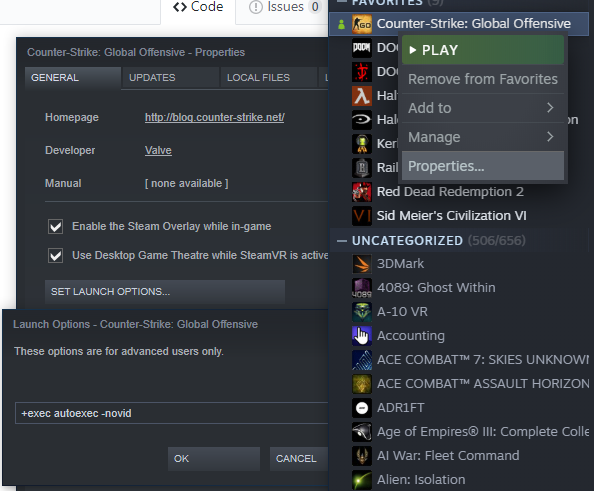

# csgoconf

Just my autoexec and launch options for csgo

autoexec.cfg goes in Steam\steamapps\common\Counter-Strike Global Offensive\csgo\cfg\

Right click on csgo in the steam library and add contents of launchopts.txt:  
 
 

